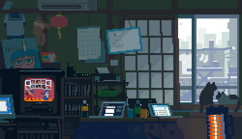
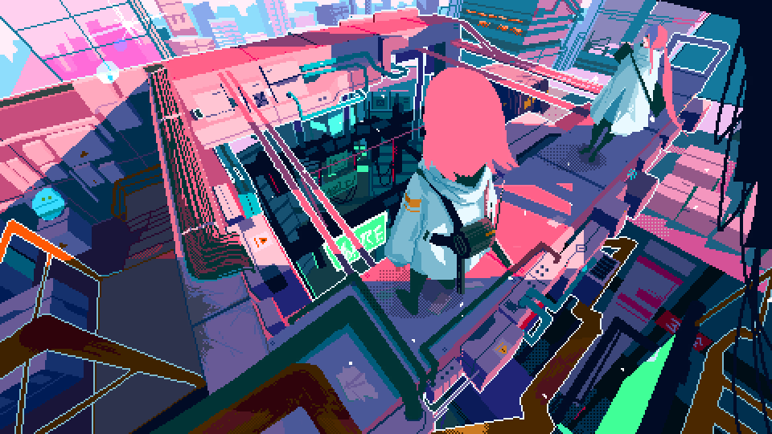
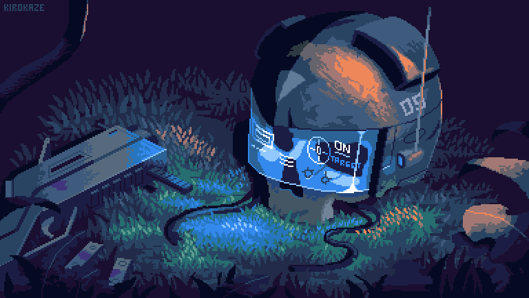

<!-- Pixel Banner -->

  

<h1 align="center">👾 Bibek Mukherjee | Full Stack Dev & AI Explorer</h1>

---

### 🧠 About Me

- ✅ **Passionate about AI, Web Dev, and Pixel Art Games!**  
- 🔨 A lifelong learner who loves building things from scratch  
- 🚀 Currently exploring advanced Spring Boot & React integration

🎓 Final Year B.Tech CSE Student  
🕹️ Making pixel RPGs for fun — and learning a ton while doing it  
📄 Published Research Paper in IJSREM   
🌱 Currently learning: Microservices, React Animations, Spring Cloud

---

### 🛠️ Tech Stack

  

---

### 🖼️ Pixel Vibes

  
  
  

---

### 📫 Let's Connect

  

---

> “Code is like pixel art — one dot at a time.” — Bibek 👾
